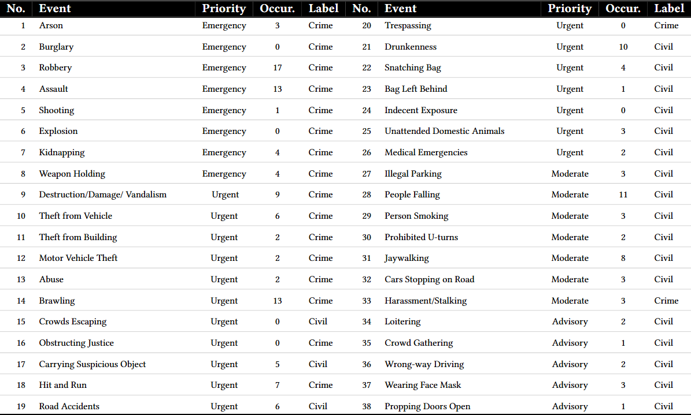

<!-- ========================= -->
<!-- MRVS README Hero Section  -->
<!-- ========================= -->

<h1 align="center">
  Designing Multi-Robot Ground Video Sensemaking with Public Safety Professionals
</h1>

  <b>A Testbed Dataset / System for Public Safety Video Sensemaking with Ground Robots</b>
   
  <i>CHI 2026 </i>

  <a href="https://puqi7.github.io/MRVS_VideoSensemaking/">🌐 Project Page</a> ·
  <a href="https://arxiv.org/abs/2602.08882">📄 Paper</a> ·
  <a href="https://huggingface.co/datasets/Puqi7/MRVS_anomaly_long_video_dataset">📦 Dataset</a> ·
  <a href="https://websitefrontend-jhzm.onrender.com/">💻 UI demo</a>

We present an abnormal video in the left side while in the right side we present a normal video from our testbed (video dataset). 

Add two day gif here
Add two night gif here 

  
  

 Events-of Interest (EoI) table 

 Video Dataset 

 Examples of EoI from our dataset 

 Robot Captured Actor-perfromed EoI Long Videos 

Add robot caprture figure (in the night)
Add people controlling robot 

 Design Requirement

 MRVS System 

Add backend figure
Add result table 

Add front-end gif 
Add expert figures 

## Acknowledgments
Parts of this project page were adopted from the [Nerfies](https://nerfies.github.io/) page.

## Website License
 This work is licensed under a <a rel="license" href="http://creativecommons.org/licenses/by-sa/4.0/">Creative Commons Attribution-ShareAlike 4.0 International License</a>.
